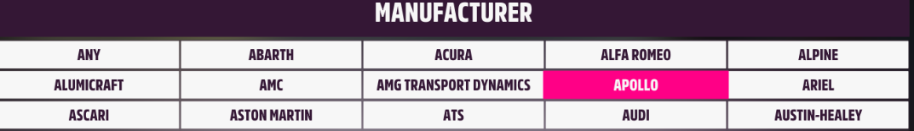
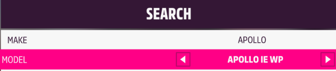

# Forza-Horizon-5-Auction-Buyout-Sniper

This is the first script using image matching (e.g., OpenCV) to create a much faster and more stable macro for sniping a variety of desired cars in the auction house. Rather than sniping single specific cars, this script aims at on fully collection for this game.

Note: This script DOESN'T gaurantee 100% to snipe the auctions. Due to network and other potential issues, you may run it for nothing or get quite a few cars within a long time.

## Performance Preview (2MIN Demo)

In this demo, we let the script snipe these four cars `AUDI RS`, `AUDI R1`, `MEGANE R26 R`, `MINI COUNTRYMAN`.


## Features
✅ Fast sniping   
✅ Enable single or multi auction snipers      
✅ Auto switch cars in multi auctions   
✅ Easy set-up (only need to add car details in `CARS.csv`)  
✅ Memory efficient with only 40MB    

## Limits:
1. The location (numbers) in [CARS.csv](https://github.com/YiwenLu-yiwen/Forza-5-CAR-BUYOUT-Sniper/blob/main/CARS.csv) __MUST BE CORRECT__!!!

## Future Work
- [ ] Apply a better interface rather than console.
- [ ] Fit any resolution.

## Pre-Requirements
1. System Requirements:

    This script only tests well on windows 10 with 1920*1080 (100% scale).

    

2. Game setting: 
    
    I am using [Hyper-V](https://github.com/jamesstringerparsec/Easy-GPU-PV), a GPU Paravirtualization on Windows like virtual box on MacOS. Therefore, the HDR setting shows wired here. But it doesn't matter.

    

    To save energy and gpu cost, strongly suggest to set "VERY LOW" in grahic setting.

    

3. Default language is English, any other language should replace all screenshots (See images folder, DON'T CHANGE FILE NAME)

4. Modify the [CARS.csv](https://github.com/YiwenLu-yiwen/Forza-5-CAR-BUYOUT-Sniper/blob/main/CARS.csv)
    
    This is an example of `APOLLO IE WP`. This car shows `APOLLO,APOLLO IE WP,3,1,2,0` in the first line in [CARS.csv](https://github.com/YiwenLu-yiwen/Forza-5-CAR-BUYOUT-Sniper/blob/main/CARS.csv). Let's explain what these numbers mean and how to build your own target car.
    
    Firstly, we define that `ANY` in `MANUFACTURER` page locates at `X=0, Y=0`. Then, `APOLLO` is at `X=3,Y=1`.

    

    Next, back to the search page, `APOLLO IE WP` in `MODEL` section only needs `2` right turn from the initial showing `ANY`.
    
    

    Lastly, set the cell under `Numbers_buy=n`. `n>0` means that you want to snipe `n` number of this car, whereas `n=0` means that the script finishes sniping it or you want to skip it.

    Hence, `APOLLO,APOLLO IE WP,3,1,2,0` means, `APOLLO` Make locates at `X=3, Y=1` and it needs `2` right turn to reach `APOLLO IE WP` model with `0` times car sniper (the script will skip this car).
   
## How to run it
1. Run with Python
    
    Python version must below 3.13
```
Git Clone https://github.com/YiwenLu-yiwen/Forza-5-CAR-BUYOUT-Sniper.git
cd Forza-5-CAR-BUYOUT-Sniper
pip install -r requirements.txt
python main.py
```

2. Use Compiled Zip 

    Steps: 
    1. Download zip file on [release page](https://github.com/YiwenLu-yiwen/Forza-5-CAR-BUYOUT-Sniper/releases).
    2. Modify the images folder.
    3. Modify the `CARS.csv`.
    4. Run the exe.

## Start and Enjoy
1. Make sure you have checked all above info.

2. Modify the `CARS.csv` for your own needs.

3. Set auction filter to "ANY".

4. Stay with this screen (Search auctions must be active), then run the script or exe.


