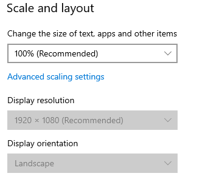
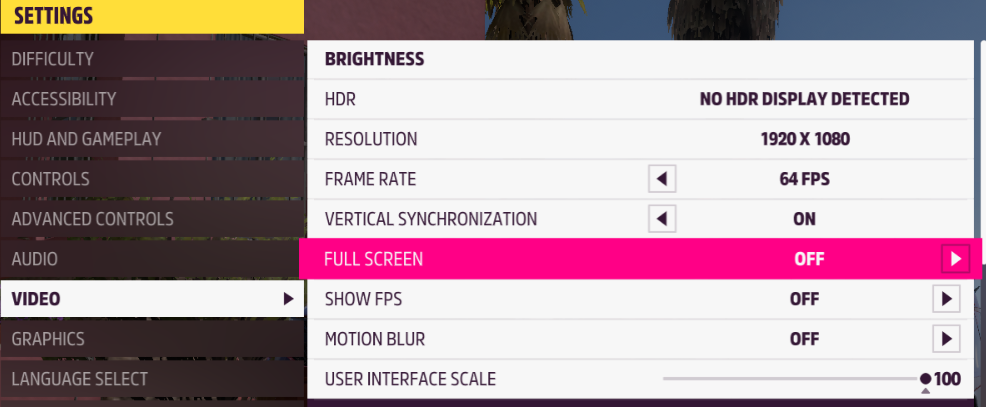
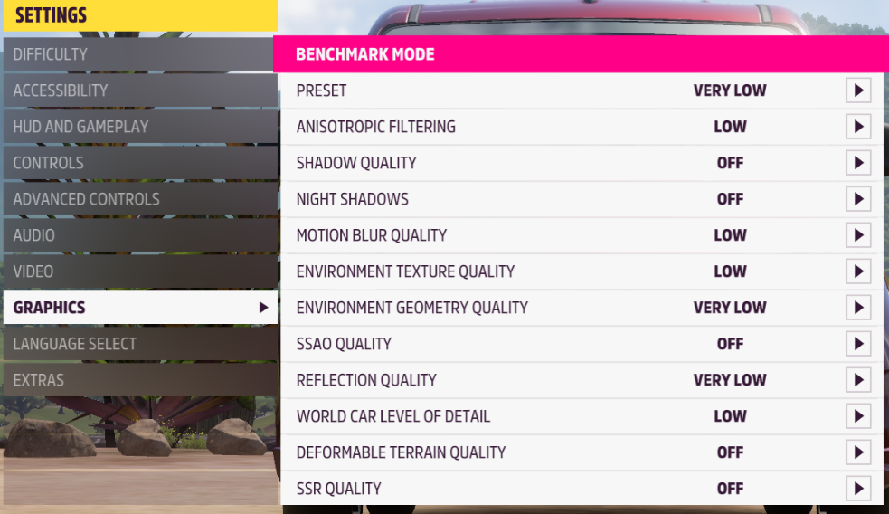
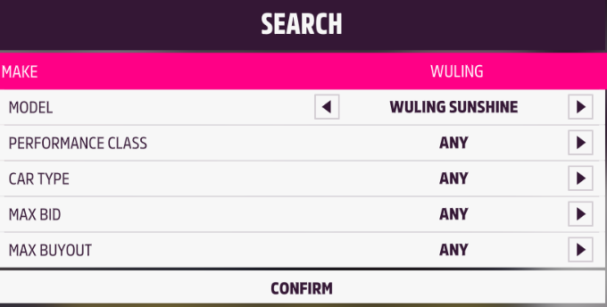
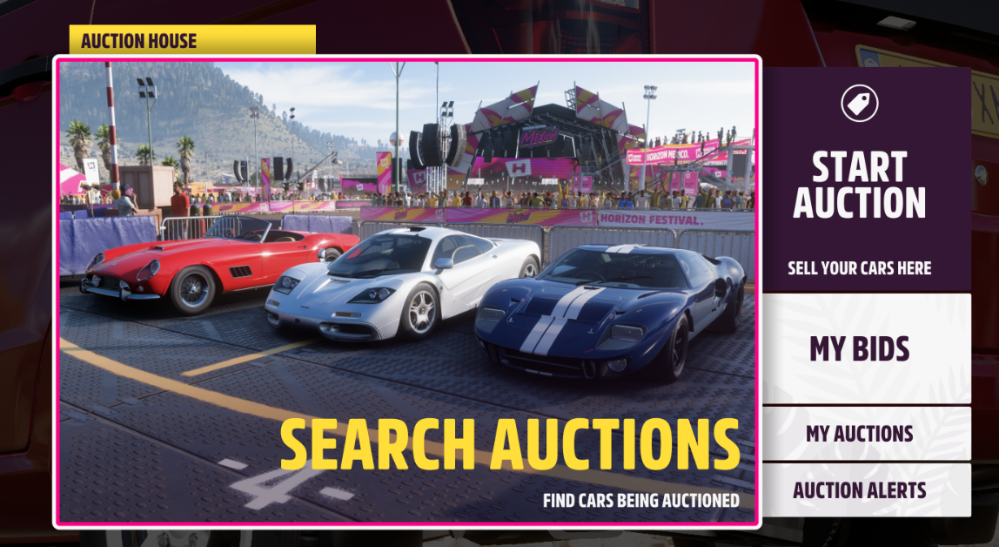

# Forza-5-CAR-BUYOUT-Sniper
This script uses image matching (e.g., OpenCV) to create a much faster and more stable macro for purchasing the desired car in the auction house. 

Note: This script DOESN'T gaurantee 100% to snipe the car. Due to network and other potential issues, you may run it for nothing or get quite a few cars within a long time.

## Preview (10s to explain everything)


## Benefits
1. Automatically snipe the car with pre-set requirements.
2. Only need 3 steps to set-up within 10 mins.
3. This script only needs 40MB memory.

## Pre-Requirements
1. System Requirements:

    This script only tests well on windows 10 with 1920*1080 (100% scale).

    

2. Game setting: 
    
    I am using [Hyper-V](https://github.com/jamesstringerparsec/Easy-GPU-PV), a GPU Paravirtualization on Windows like virtual box on MacOS. Therefore, HDR setting shows wired here.

    

    To save energy and gpu cost, strongly suggest to set "VERY LOW" in grahic setting.

    

3. Default language is English, any other language should replace all screenshots (See images folder, DON'T CHANGE FILE NAME)

## How to run it
1. Run with Python
    
    Python version must below 3.13
```
Git Clone https://github.com/YiwenLu-yiwen/Forza-5-CAR-BUYOUT-Sniper.git
cd Forza-5-CAR-BUYOUT-Sniper
pip install -r requirements.txt
python main.py
```

2. Use Compiled Zip 

    Steps: 
    1. Download zip file on [release page](https://github.com/YiwenLu-yiwen/Forza-5-CAR-BUYOUT-Sniper/releases).
    2. Modify the images folder.
    3. Run the exe.

## Start and Enjoy
1. Make sure you have checked all above info.

2. Don't forget to set your auction filter.

   

3. Stay with this screen (Search auctions must be active), then run the script or exe.



## Future Work
1. Apply a better interface rather than console.
2. Accept multiple car auctions.
3. Fit any resolution.
